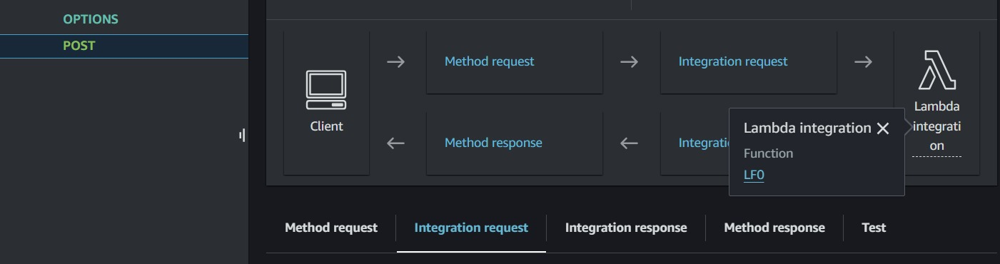
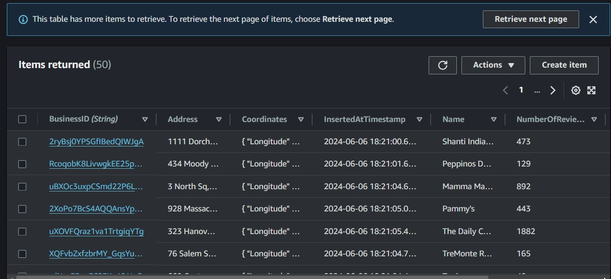
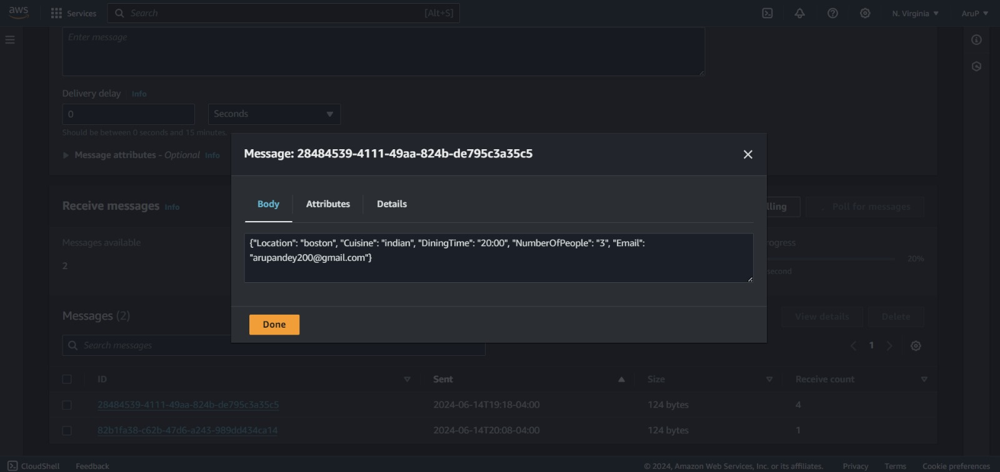
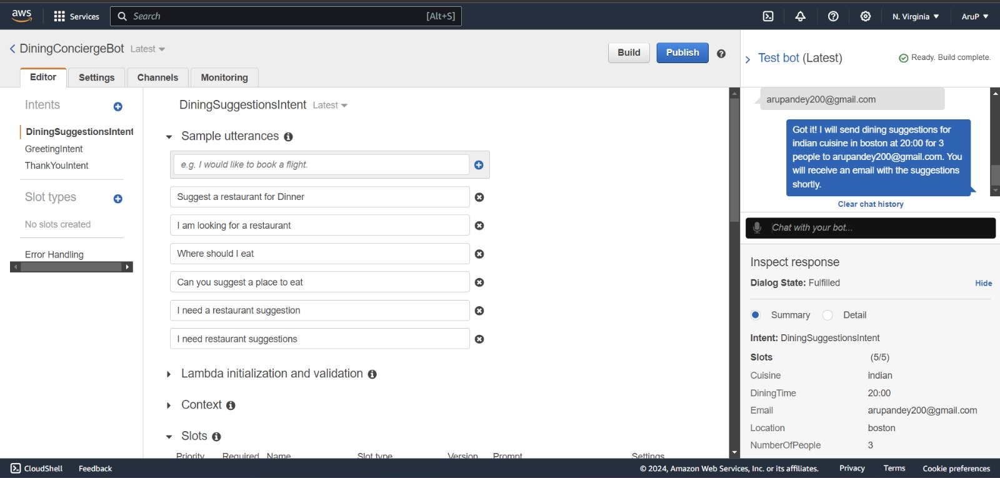

# Cloud Dining Chatbot
A chatbot for providing dining suggestions based on cuisine
Deployed on AWS

## Screenshots

### API Gateway Configuration

* This image shows the configuration of an API Gateway POST method that is integrated with an AWS Lambda function (LF0). The flow indicates that the client sends a request, which goes through method request, integration request, and then invokes the Lambda function.
* The Lambda function (LF0) is responsible for handling the API requests. In your project, this Lambda function processes the chat messages from the chatbot and returns responses.

### DynamoDB Table

* This image shows a DynamoDB table named yelp-restaurants containing information about various restaurants.
* The table includes fields like BusinessID, Address, Coordinates, InsertedAtTimestamp, Name, and NumberOfReviews. These fields store essential information about each restaurant, which is used for providing dining suggestions.
*  The data in this table is populated using the Yelp API and includes random restaurants from Manhattan.

###  SQS Message

* This image shows a message in an Amazon SQS queue (Q1). The message contains details about a user's dining request.
* The body of the message includes the following details:
    * Location: "boston"
    * Cuisine: "indian"
    * DiningTime: "20:00"
    * NumberOfPeople: "3"
    * Email: "arupxxxxxx@gmail.com"
* The information in this queue is used by the suggestion module to process the request and provide restaurant recommendations.

### Amazon Lex Bot Configuration

* This image shows the configuration of the DiningSuggestionsIntent in the Amazon Lex chatbot. This intent collects user preferences for dining suggestions.
* Various sample utterances that the bot can understand, such as "Suggest a restaurant for Dinner" and "Where should I eat".
* The slots collect necessary information from the user, including Cuisine, DiningTime, Email, Location, and NumberOfPeople.
* The bot confirms the received information and informs the user that they will receive dining suggestions via email shortly.

### Elasticsearch Data

* This image shows data stored in an Elasticsearch index called restaurant-data.
* Each document in the index represents a restaurant, with fields such as BusinessID, CuisineType, and other relevant details.
* The query results display 100 hits (matching documents) for restaurants with the CuisineType field set to "Indian".
* This data is used by the project to quickly search and retrieve restaurant recommendations based on user preferences. Elasticsearch allows for efficient querying and filtering of large datasets.
  
  

### Chatbot Interface

* This image shows a conversation between a user and the Dining Concierge chatbot.
* The chatbot asks the user for details such as the number of people in the party and the email address for sending recommendations.
* The chatbot confirms the receipt of the user's dining preferences and informs them that dining suggestions will be sent via email. This message includes details like cuisine type, location, dining time, number of people, and the user's email.
* This demonstrates the chatbot's ability to collect necessary information and provide feedback to the user, ensuring a smooth and interactive user experience.

